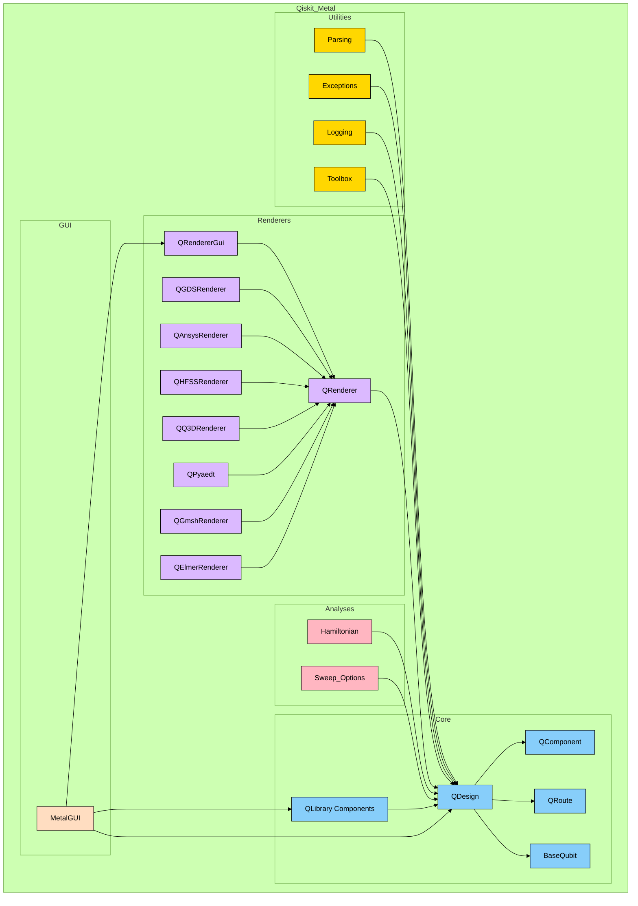

# Quantum Metal (formerly: Qiskit Metal)
[](https://opensource.org/licenses/Apache-2.0)<!--- long-description-skip-begin -->[](https://github.com/Qiskit/qiskit-metal/releases)<!--- long-description-skip-begin -->[](https://qisk.it/join-slack)[](https://doi.org/10.5281/zenodo.4618153) [Discord](https://discord.gg/kaZ3UFuq)

>
> Quantum Metal is an open-source framework for engineers and scientists to design superconducting quantum devices with ease.


## ⚠️ Transition Notice – Qiskit Metal → Quantum Metal (v0.5)

As part of the **v0.5 release**, we are formally beginning the transition of the project:

- **New project name:** Quantum Metal
- **Current import path:** `qiskit_metal` (will remain until a follow-up PR)
- **Repository rename:** This repository will soon be renamed to **`quantum-metal`**
- **GitHub continuity:** We will keep the same repo, issues, stars, forks, and history
- **PyPI transition:** `qiskit-metal` will remain available in a stable, archived state
- **Future package:** `quantum-metal` (or similar) will be published after the import change PR

This ensures a smooth, non-breaking transition for all existing users.


## 🌐 Part of the Quantum Device Design Ecosystem

Quantum Metal has graduated from being an IBM maintained project and is now one of the core tools in a growing community ecosystem for superconducting quantum device design and education, including:

- **Quantum Device Workspace (QDW)** – https://qdw-ucla.squarespace.com/
  Hosted annually at UCLA/USC with invited leaders in the field.
  Recent speakers include: *Michel Devoret, Andreas Wallraff, Zlatko Minev, Eli Levenson-Falk.*
  [Video recordings](https://www.youtube.com/@uclaqcsa)

  [Sign for 2026](https://qdw-ucla.squarespace.com/qdw2026) to meet the community, learn from experts, and participate directly.*

- **Quantum Device Consortium (QDC)** — an upcoming community organization that will maintain and evolve Quantum Metal as part of a shared ecosystem of tools (including SQUADDS, SQDMetal, scqubits, pyEPR, and many others).
  *([Website and governance page](https://qdc-qcsa.vercel.app))* [Discord Channel here](https://discord.gg/kaZ3UFuq)


## 🌱 From IBM to a Community-Maintained Project

Originally developed at IBM, originated by **Dr. Zlatko K. Minev**, Qiskit Metal has, over the last two years, naturally transitioned into a **community-driven project** supported by multiple universities, research groups, labs, and individual contributors.

This v0.5 release marks the formal graduation into that next phase of the project’s life.

Development continues through the **QDC**, the community, and active maintainers, working in close collaboration with Zlatko Minev and contributors across QDW/QDC who are shaping this next chapter.

---

## 🙏 BIG THANK YOU to Community Contributors (PR #1002)

This release is the result of a substantial collective effort.
Our deepest thanks go to:

**Sadman Ahmed Shanto**, **Abhishek Chakraborty**, **PositroniumJS**, **SamWolski**,
**Nicolas Dirnegger**, **Eli Levenson-Falk**, and **Murat Can Sarıhan**

for their extensive testing, debugging, patching, platform validation, and contributions to the massive PySide6 transition in PR #1002.

We are grateful to all users, contributors, and maintainers who continue to move the project forward.


<!-- ## Installation
If you are interested in customizing your experience, or if you are unable to install qiskit-metal using the `pip install` instructions below, consider installing directly the source code, following the instructions in the [documentation](https://qiskit-community.github.io/qiskit-metal/installation.html) and/or the [installation instructions for developers](https://github.com/Qiskit/qiskit-metal/blob/main/README_Developers.md).

For normal use, please continue reading.

### The Qiskit Metal deployed package
You can install Qiskit Metal via the pip tool (a python package manager).
```bash
pip install qiskit-metal
```
PIP will handle most of the dependencies automatically and you will always install the latest (and well-tested) version of the package.

Some of the dependencies, namely pyside2 and geopandas, might require manual installation, depending on your specific system compatibility. If you encounter installation or execution errors, please refer first to the [FAQ](https://qiskit-community.github.io/qiskit-metal/faq.html).

We recommend to install qiskit-metal in a conda environment or venv, to prevent version conflicts with pre-existing package versions.

### Jupyter Notebook
At this time, we recommend using Jupyter notebook/lab to be able to access all the Qiskit Metal features. Jupyter is not installed with the default dependencies, to accommodate those users intending to utilize a centralized or customized installation.

If you require a fresh installation, please refer to either [anaconda.org](https://anaconda.org/) or [jupyter.org](https://jupyter.org/install).

Unless you installed the entire `jupyter` package in your current environment, do not forget to create the appropriate kernel to make the environment (thus qiskit-metal) available to jupyter (instructions in the [FAQ](https://qiskit-community.github.io/qiskit-metal/faq.html)) -->

## Installation

During the transition to **Quantum Metal**, the package is still published on PyPI under the legacy name `qiskit-metal` until the import path is updated in a follow-up release. The instructions below ensure users can install the new **v0.5** release while keeping compatibility.

If you prefer installing from source or contributing, please follow the developer installation guide in the [documentation](https://qiskit-community.github.io/qiskit-metal/installation.html) and/or the [developer README](https://github.com/Qiskit/qiskit-metal/blob/main/README_Developers.md).

### Installing the Current Release (v0.5)

Quantum Metal is now available on PyPI:  
`pip install quantum-metal`  
Project page: https://pypi.org/project/quantum-metal/

If you prefer installing from source, clone and install locally (steps below). Continuous integration runs on **Python 3.11 and 3.12** across Linux (Ubuntu 24.04), macOS 15, and Windows, plus separate jobs for lint and docs. Sticking to those versions mirrors the CI-tested setup; on Ubuntu you may need extra system libs for Gmsh (see CI script).

> **Key notes to keep in mind:**
>
> * Python **3.11/3.12** mirror the CI matrix; earlier 3.10 also works but isn’t CI-covered.
> * macOS ARM users should avoid Python 3.12+ to prevent C/C++ toolchain errors.
> * `uv` is the **preferred and fastest** method and avoids most scientific‑stack headaches.

### Preferred: `uv` (fast, modern, reliable)
First install `uv`, then clone the repository, use Python 3.11, set up the virtual environment, then install requirements and Quantum Metal.

- **macOS / Linux (bash):**
  ```bash
  curl -LsSf https://astral.sh/uv/install.sh | sh
  git clone https://github.com/qiskit-community/qiskit-metal.git quantum-metal
  cd quantum-metal
  uv python pin 3.11
  uv venv
  source .venv/bin/activate
  uv pip install -r requirements.txt
  uv pip install -e .
  ```
- **Windows (PowerShell):**
  ```powershell
  iwr https://astral.sh/uv/install.ps1 -UseBasicParsing | iex
  git clone https://github.com/qiskit-community/qiskit-metal.git quantum-metal
  cd quantum-metal
  uv python pin 3.11
  uv venv
  .\.venv\Scripts\Activate.ps1
  uv pip install -r requirements.txt
  uv pip install -e .
  ```
On Ubuntu you may need system packages for Gmsh/Qt (see CI: `libglu1-mesa`, `libegl1-mesa-dev`), and on Windows/macOS ensure build tools/CLT are present if you add native extensions.

### Option 2: Conda (best for binary-heavy scientific stacks)

```bash
conda create -n quantum-metal python=3.11
conda activate quantum-metal
pip install -r requirements.txt
pip install -e .
```

### Option 3: Standard venv (simple, lightweight)

```bash
python3.11 -m venv qm_env
source qm_env/bin/activate
pip install --upgrade pip
pip install -r requirements.txt
pip install -e .
```


### Using Jupyter Notebook

We recommend using Jupyter Notebook/Lab to access the full GUI and interactive features. If Jupyter is not installed in your environment, install it with:

```bash
pip install jupyterlab
```

If needed, add your environment as a Jupyter kernel:

```bash
python -m ipykernel install --user --name quantum-metal
```

## Quick Start: Creating Your First Quantum Component in Qiskit Metal:
Now that Qiskit Metal is installed, it's time to begin working with it.
We are ready to try out a quantum chip example, which is simulated locally using
the Qiskit MetalGUI element. This is a simple example that makes a qubit.
```python
from qiskit_metal import designs, MetalGUI, open_docs, draw

# Start a planar-chip quantum device design
design = designs.DesignPlanar()
design.chips.main.size.size_x = '11mm'
design.chips.main.size.size_y = '9mm'
print(design.chips.main)

# Launch the Qiskit Metal GUI to interactively view, edit, and simulate the design
gui = MetalGUI(design)

# Create a new qubit form the library, a transmon, by creating an object of this class.
from qiskit_metal.qlibrary.qubits.transmon_pocket import TransmonPocket
# Let's also add a connector pad, called "a" with default options, you can overwrite them as dictionary keys
q1 = TransmonPocket(design, 'Q1', options=dict(connection_pads=dict(a=dict())))

# To see qubit, rebuild the design with this new qubit in place
gui.rebuild()
# Select for editing, highlight, and autoscale gui view
gui.edit_component('Q1')
gui.autoscale()

# Change options.
q1.options.pos_x      = '0.5 mm'
q1.options.pos_y      = '0.25 mm'
q1.options.pad_height = '90um'
q1.options.pad_width  = '455um'
q1.options.pad_gap    = '30 um'

# Update the component geometry after changing the options.
gui.rebuild()
gui.autoscale()
```


Get a list of all the qcomponents in QDesign and then zoom on them.
```python
all_component_names = design.components.keys()
gui.zoom_on_components(all_component_names)
```

<!-- ```python
# Lets the design automatically delete an existing component when you create a new component with the same name, so the new component replaces the old one.
design.overwrite_enabled = True
``` -->

#### Closing the Qiskit Metal GUI.
```python
>>> gui.main_window.close()
```

A script is available [here](https://qiskit-community.github.io/qiskit-metal/tut/overview/1.1%20High%20Level%20Demo%20of%20Qiskit%20Metal.html), where we also show the overview of Qiskit Metal.

## Community and Support

#### Watch the recorded tutorials
[](https://youtube.com/playlist?list=PLOFEBzvs-VvqHl5ZqVmhB_FcSqmLufsjb)

The streaming will also be recorded and made available [here](https://www.youtube.com/playlist?list=PLOFEBzvs-VvqHl5ZqVmhB_FcSqmLufsjb) for offline review.

#### Take part in the live tutorials and discussion
Through June 2021 we are offering live tutorials and Q&A. [Sign up](https://airtable.com/shrxQEgKqZCf319F3) to receive an invite to the upcoming sessions.  The streaming will also be recorded and made available for offline review.  Find [here](https://github.com/Qiskit/qiskit-metal/blob/main/README_Tutorials.md) more details on schedule and use the Slack channel to give us feedback and to request the most relevant content to you.

#### Get help: Slack
[](https://qisk.it/join-slack)

Use the slack channel.  Join [qiskit slack](https://qisk.it/join-slack) and then join the `#metal` channel to communicate with the developers and other participants.  You may also use this channel to inquire about collaborations.

## Contribution Guidelines
If you'd like to contribute to Qiskit Metal, please take a look at our
[contribution guidelines](https://github.com/Qiskit/qiskit-metal/blob/main/CONTRIBUTING.md). This project adheres to Qiskit's [code of conduct](https://github.com/Qiskit/qiskit-metal/blob/main/CODE_OF_CONDUCT.md). By participating, you are expected to uphold this code.
We use [GitHub issues](https://github.com/Qiskit/qiskit-metal/issues) for tracking requests and bugs. Please
[join the Qiskit Slack community](https://qisk.it/join-slack)
and use our [Qiskit Slack channel](https://qiskit.slack.com) for discussion and simple questions.
For questions that are more suited for a forum we use the Qiskit tag in the [Stack Exchange](https://quantumcomputing.stackexchange.com/questions/tagged/qiskit).

## Next Steps
Now you're set up and ready to check out some of the other examples from our
[Qiskit Metal Tutorials](https://github.com/Qiskit/qiskit-metal/blob/main/tutorials/) repository or [Qiskit Metal Documentation](https://qiskit-community.github.io/qiskit-metal/tut/).


---

# Big Picture Architecutre Overview

### Diagram

The **Qiskit Metal** codebase is organized into several key modules, each with a distinct role in enabling the design, analysis, and visualization of quantum circuits. Below is an overview of the primary components and their interactions, discussed deeper in the [Architecture Readme](README_Architecture.md) and the docs:




### Core
The **Core** module serves as the backbone of Qiskit Metal, housing essential elements for design and component creation:
- **QLibrary Components**: Predefined library of quantum circuit elements, such as qubits and resonators, that can be used in designs.
- **QDesign**: The central design framework that integrates all components and handles design rules.
- **QComponent**: Base class for all components in the design.
- **QRoute**: Specialized class for managing connections between components.
- **BaseQubit**: Represents foundational qubit structures used in circuit designs.

### Renderers
The **Renderers** module facilitates exporting designs to external tools for electromagnetic simulation and layout rendering:
- **QRenderer**: Base class for all renderers.
- **QRendererGui**: GUI interface for managing renderers.
- Specialized renderers like:
  - **QGDSRenderer**
  - **QAnsysRenderer**
  - **QHFSSRenderer**
  - **QQ3DRenderer**
  - **QPyaedt**
  - **QGmshRenderer**
  - **QElmerRenderer**

These renderers enable integration with industry-standard tools for detailed simulation and fabrication.

### Analyses
The **Analyses** module includes tools for performing simulations and extracting insights from designs:
- **Hamiltonian**: Supports calculations of Hamiltonian parameters.
- **Sweep Options**: Provides tools for parametric sweeps and optimizations.


### GUI
The **GUI** module provides tools for user-friendly interaction with Qiskit Metal. The **MetalGUI** clas is the primary graphical interface for managing designs and visualizations. It is discussed in more depth in the [Architecture Readme](README_Architecture.md).

### Utilities
The **Utilities** module supports the overall functionality of Qiskit Metal by offering supplementary tools.


### Key Interactions
- The **Core** modules form the foundation and integrate tightly with the **Renderers**, **GUI**, and **Analyses** modules.
- The **GUI** depends on the **Core** and **Renderers** to provide visualization and interactivity.
- The **Renderers** serve as bridges between Qiskit Metal and external tools, interacting with the **Core** to export designs.
- The **Analyses** modules leverage the **Core** to extract meaningful data for optimization and validation.
- The **Utilities** modules provide essential supporting functionalities across the entire codebase.

This modular structure ensures scalability, flexibility, and ease of use for designing, analyzing, and fabricating quantum circuits.


---

# Backmatter

## Authors and Citation
Qiskit Metal is the work of [many people](https://github.com/Qiskit/qiskit-metal/pulse/monthly) who contribute to the project at different levels. Metal was conceived and developed by [Zlatko Minev](https://www.zlatko-minev.com) at IBM; then co-led with Thomas McConkey. If you use Qiskit Metal, please cite as per the included [BibTeX file](https://github.com/Qiskit/qiskit-metal/blob/main/Qiskit_Metal.bib). For icon attributions, see [here](https://github.com/Qiskit/qiskit-metal/blob/main/qiskit_metal/_gui/_imgs/icon_attributions.txt).

## Changelog and Release Notes
The changelog provides a quick overview of notable changes for a given release.

The changelog for a particular release can be found in the correspondent Github release page. For example, you can find the changelog for the `0.0.4` release [here](https://github.com/Qiskit/qiskit-metal/releases/tag/0.0.4)

The changelog for all releases can be found in the release page: [](https://github.com/Qiskit/qiskit-metal/releases)

Additionally, as part of each release detailed release notes are written to document in detail what has changed as part of a release. This includes any documentation on potential breaking changes on upgrade and new features.

## License
[Apache License 2.0](https://github.com/Qiskit/qiskit-metal/blob/main/LICENSE.txt)
