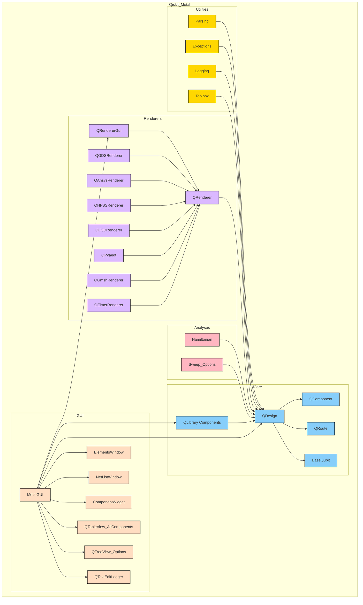

# Qiskit Metal Architecture
The high level Metal architecture is diagramed in the overview below.  The user workflow is diagramed in the workflow link below as well.

* [Overview](/docs/overview.rst)
* [Workflow](/docs/workflow.rst)

## Big Picture Architecutre Overview

### Diagram

The **Qiskit Metal** codebase is organized into several key modules, each with a distinct role in enabling the design, analysis, and visualization of quantum circuits. Below is an overview of the primary components and their interactions:

### Core
The **Core** module serves as the backbone of Qiskit Metal, housing essential elements for design and component creation:
- **QLibrary Components**: Predefined library of quantum circuit elements, such as qubits and resonators, that can be used in designs.
- **QDesign**: The central design framework that integrates all components and handles design rules.
- **QComponent**: Base class for all components in the design.
- **QRoute**: Specialized class for managing connections between components.
- **BaseQubit**: Represents foundational qubit structures used in circuit designs.

### GUI
The **GUI** module provides tools for user-friendly interaction with Qiskit Metal:
- **MetalGUI**: The primary graphical interface for managing designs and visualizations.
- **ElementsWindow**: Displays available circuit elements.
- **NetListWindow**: Shows the connections between components.
- **ComponentWidget**: Offers detailed views and controls for individual components.
- **QTableView_AllComponents**: Lists all components in the design.
- **QTreeView_Options**: Presents configuration options in a tree structure.
- **QTextEditLogger**: Logs activities and messages for troubleshooting and feedback.

### Renderers
The **Renderers** module facilitates exporting designs to external tools for electromagnetic simulation and layout rendering:
- **QRenderer**: Base class for all renderers.
- **QRendererGui**: GUI interface for managing renderers.
- Specialized renderers like:
  - **QGDSRenderer**
  - **QAnsysRenderer**
  - **QHFSSRenderer**
  - **QQ3DRenderer**
  - **QPyaedt**
  - **QGmshRenderer**
  - **QElmerRenderer**

These renderers enable integration with industry-standard tools for detailed simulation and fabrication.

### Analyses
The **Analyses** module includes tools for performing simulations and extracting insights from designs:
- **Hamiltonian**: Supports calculations of Hamiltonian parameters.
- **Sweep Options**: Provides tools for parametric sweeps and optimizations.

### Utilities
The **Utilities** module supports the overall functionality of Qiskit Metal by offering supplementary tools:
- **Parsing**: Manages data parsing for design input and output.
- **Exceptions**: Handles error reporting and debugging.
- **Logging**: Tracks system activities and events.
- **Toolbox**: Provides miscellaneous helper functions.

---

### Key Interactions
- The **Core** modules form the foundation and integrate tightly with the **Renderers**, **GUI**, and **Analyses** modules.
- The **GUI** depends on the **Core** and **Renderers** to provide visualization and interactivity.
- The **Renderers** serve as bridges between Qiskit Metal and external tools, interacting with the **Core** to export designs.
- The **Analyses** modules leverage the **Core** to extract meaningful data for optimization and validation.
- The **Utilities** modules provide essential supporting functionalities across the entire codebase.

This modular structure ensures scalability, flexibility, and ease of use for designing, analyzing, and fabricating quantum circuits.

## Required Attributes for Custom Components

### QLibrary Components
A base qlibrary component contains several attributes and a method that must be overridden by qlibrary components that extend the base.

**Attributes**
| Attribute          | Description                                            |
| ------------------ | ------------------------------------------------------ |
| default_options    | Default drawing options                                |
| component_metadata | Component metadata                                     |
| options            | A dictionary of the component-designer-defined options |

**Methods**
| Method | Description |
| ------ | ----------- |
| make   | The make function implements the logic that creates the geometry (poly, path, etc.) from the qcomponent.options dictionary of parameters, and the adds them to the design, using qcomponent.add_qgeometry(...), adding in extra needed information, such as layer, subtract, etc. |

### QRenderer
A base qrenderer contains several attributes and several methods that must be overridden by qrenderers that extend the base.

**Attributes**
| Attribute          | Description                   |
| ------------------ | ----------------------------- |
| name               | Renderer name                 |
| element_extensions | Element extensions dictionary |
| element_table_data | Element table data            |

**Methods**
| Method              | Description                                                                             |
| ------------------- | --------------------------------------------------------------------------------------- |
| render_chips        | Render all chips of the design.  Calls render_chip for each chip.                       |
| render_chip         | Render the given chip.                                                                  |
| render_components   | Render all components of the design.  If selection is none, then render all components. |
| render_component    | Render the specified component.                                                         |
| render_element      | Render the specified element.                                                           |
| render_element_path | Render an element path.                                                                 |
| render_element_poly | Render an element poly.                                                                 |

### QRendererGui
In addition to the attributes and methods that must be overwritten by any QRenderer, a base qrenderergui has additional methods that must be overwritten by all qrendererguis that extend the base.

| Method            | Description                 |
| ----------------- | --------------------------- |
| setup_fig         | Setup the given figure.     |
| style_axis        | Style the axis.             |
| render_design     | Render the design.          |
| render_component  | Render the given component. |
| render_shapely    | Render shapely.             |
| render_connectors | Render connectors.          |
| clear_axis        | Clear the axis.             |
| clear_figure      | Clear the figure.           |
