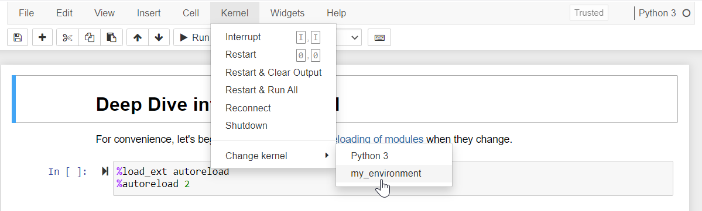

.. _faq:

********************************
FAQ's
********************************

Frequently asked questions.

.. attention::

   **Some answers below cover legacy environments** (PySide2, Python 3.7–3.9,
   macOS 10.14, pre-v0.5 ``qiskit-metal`` PyPI package). The current supported
   stack is **Python 3.10–3.12** with **PySide6** (only when the ``[gui]``
   extra is installed). If you hit a problem on the current stack and don't
   see it here, check :doc:`installation`, :doc:`headless-usage`, or open an
   issue on `GitHub <https://github.com/qiskit-community/qiskit-metal/issues>`_.

.. _faq_setup:

----------------------
Setting up environment
----------------------

**Q: jupyter notebook/lab cannot find qiskit_metal. Why is that?**

**A:** If you are seeing: ``ModuleNotFoundError: No module named 'qiskit_metal'`` in jupyter notebook/lab, you are using a jupyter installation outside of your current environment and you therefore need to create a kernel that refers to the environment where you installed qiskit_metal. To do so, install and configure ipykernel.

*conda*:

.. code-block:: bash

   conda activate <env_name>
   conda install ipykernel
   ipython kernel install --user --name=<any_name_for_kernel>

*virtualenv*:

.. code-block:: bash

   source <env_name>/bin/activate  # or .\<env_name>\Scripts\activate
   python -m pip install ipykernel
   ipython kernel install --user --name=<any_name_for_kernel>

You can now restart jupyter notebook/lab and switch to the newly created kernel using the menu `Kernel>Change Kernel`.

If jupyter notebook/lab is still unable to find qiskit_metal, you might need to re-install qiskit_metal after installing ipykernel.

You can completely prevent the ModuleNotFoundError by installing `jupyter` or `jupyterlab` inside the environment, instead of using a pre-existing installation.

**Q: Why is the pip installation asking to install geopandas? Or why is it asking for a path to gdal-config?**

**A:** If you see *"A GDAL API version must be specified. Provide a path to gdal-config..."* on Windows, this is a known limitation of the Windows wheels for ``gdal`` and ``fiona``. The simplest fix is to use **conda** for these packages:

.. code-block:: bash

   conda install -c conda-forge geopandas
   python -m pip install --no-deps -e .

If you cannot use conda, modern ``geopandas`` (>=1.0) for Python 3.10+ ships with bundled GDAL on Windows. Make sure you are on a current Python (3.10–3.12) and an up-to-date ``pip``. The historical ``lfd.uci.edu`` binary-wheels archive (gohlke wheels) is **no longer available** (site retired in 2022).

**Q: Why is my installation complaining about missing ``geos_c.dll``?**

**A:** This was a known bug with very old ``shapely`` (<1.8). On the current stack (Python 3.10–3.12 with shapely 2.x) the issue should not occur. If you see it, upgrade shapely: ``pip install -U shapely``, or use the conda package: ``conda install -c conda-forge shapely``.

**Q: Why do I have an invalid active developer path on MacOs?**

**A:** If you are seeing: ``xcrun: error: invalid active developer path (/Library/Developer/CommandLineTools), missing xcrun at /Library/Developer/CommandLineTools/usr/bin/xcrun`` you may be missing the Command Line Tools.

The Command Line Tools package for XCode should be already installed.
If not, they can be installed with: ``xcode-select —install``

**Q: Why can't qutip find my path?**

**A:** ``qutip`` may have issues finding your path if using VSCode, resulting in a ``KeyError: 'physicalcpu'``. If the error occurs, please add your PATH to VSCode's settings as follows.

*Windows:*

Open Windows Command Prompt and type:

``$Env:Path``

Copy the resulting output. Example: ``"PATH": "/usr/local/bin:/usr/bin:/bin:/usr/sbin:/sbin"``
Then open the applicable settings.json in your VS Code. (See how to open command palette here `here2 <https://code.visualstudio.com/docs/getstarted/tips-and-tricks>`_). Search "settings" and click Open Workspace Settings (JSON)). Paste:

.. code-block:: json

   "terminal.integrated.env.windows": {
      "PATH": "/usr/local/bin:/usr/bin:/bin:/usr/sbin:/sbin"
      }

*MacOs:*

Open Terminal and type:

``echo $PATH``

Copy the resulting output. Example: ``"PATH": "/usr/local/bin:/usr/bin:/bin:/usr/sbin:/sbin"``
Then open the applicable settings.json in your VS Code. (See how to open command palette `here <https://code.visualstudio.com/docs/getstarted/tips-and-tricks>`__). Search "settings" and click Open Workspace Settings (JSON)). Paste:

.. code-block:: json

   "terminal.integrated.env.osx": {
      "PATH": "/usr/local/bin:/usr/bin:/bin:/usr/sbin:/sbin"
      }

**Q: Why are "xcb" or "windows" found but not loaded?**

**A:** it has been observed for pip installation on fresh conda environments that this error might show up: ``Could not load the Qt platform plugin "xcb" in "" even though it was found.``

.. note::

   These errors come from PySide6 / Qt starting up — they only fire if you instantiate ``MetalGUI`` or import code that pulls Qt. If you're on the lite install (v0.7.0+ ``pip install quantum-metal`` without ``[gui]``) and you see one of these, you either need ``pip install "quantum-metal[gui]"`` or you should switch to the headless ``qm.view(design)`` path — see :doc:`headless-usage`.

For ``xcb``: based on `this source <https://forum.qt.io/topic/93247/qt-qpa-plugin-could-not-load-the-qt-platform-plugin-xcb-in-even-though-it-was-found>`_, you might be able to resolve this error by installing the dependency with ``sudo apt-get install libxcb-xinerama0``.

For ``windows``: this error intermittently shows in conda environments. It was found that the problem resolves if PySide6 is installed manually through conda: ``conda install pyside6``.

If the methods above do not work, consider trying an older version of Python (and related dependencies).

**Q: Why am I not able to start Jupyter Lab in the new environment?**

**A:** Based on: `this <https://anaconda.org/conda-forge/jupyterlab>`_, install Jupyter lab by

``conda install -c conda-forge jupyterlab``

Then re-install the qiskit-metal package with pip, for example, if you are using the github local installation flow run the following:

``python -m pip install --no-deps -e .``

**Q: Why am I seeing a Shiboken / PySide import error after upgrading?** (legacy)

**A:** If you upgraded from a pre-v0.5 release that used **PySide2** and see errors like ``Unable to import Shiboken2`` or ``'_int_pyside_extension' is not defined``, you have leftover PySide2 traces conflicting with the current **PySide6** stack. Clean up:

.. code-block:: bash

   pip uninstall -y pyside2 shiboken2
   pip install -U "quantum-metal[gui]"

If you used conda for PySide2: ``conda remove pyside2 shiboken2`` first. The cleanest fix is to start a fresh virtual environment (``uv venv`` or ``python -m venv``).

.. _gui:

-------------------------------------
Getting started with GUI development
-------------------------------------

Quantum Metal's desktop GUI (``MetalGUI``) is built on **PySide6** (Qt for
Python). Resources for learning PySide6 / Qt:

* `PySide6 official tutorials <https://doc.qt.io/qtforpython-6/tutorials/index.html>`_
* `Qt for Python: signals and slots <https://doc.qt.io/qtforpython-6/overviews/signalsandslots.html>`_
* `Real Python — PyQt/PySide GUI tutorial <https://realpython.com/python-pyqt-gui-calculator/>`_ (PyQt; concepts transfer to PySide6)

If you're working on the lite install (no Qt), see the headless workflow at
:doc:`headless-usage` instead — a Jupyter-widgets-based viewer is planned as
a lighter alternative to the desktop GUI (see
`ROADMAP.md <https://github.com/qiskit-community/qiskit-metal/blob/main/ROADMAP.md>`_).

.. _docs:

-------------
Documentation
-------------

**Q: I am seeing a lot of warnings when I build the docs.  How do I resolve them?**

**A:** There is no need to build the docs locally unless you *really* want to.  The docs can be accessed without building them yourself by navigating to `<https://qiskit-community.github.io/qiskit-metal/>`_.

If you chose to build the docs yourself, some users may see a list of warnings when building the docs.  Warnings about matplotlib text role can be safely ignored.

You can resolve other warnings by deleting the following directories and rebuilding:

   * ``docs/_build``
   * ``docs/build``
   * ``docs/stubs``

**Q: How do I download a tutorial?**

**A:** All tutorial notebooks live in the
`tutorials/ folder on GitHub <https://github.com/qiskit-community/qiskit-metal/tree/main/tutorials>`_.
To download a single notebook, navigate to it on GitHub and click the **Download raw file** button (the download icon in the top-right of the file view). To get them all, clone the repository:

.. code-block:: bash

   git clone https://github.com/qiskit-community/qiskit-metal.git
   cd qiskit-metal/tutorials

--------------------------------
Connecting to 3rd party software
--------------------------------

**Q: I'm having trouble connecting to Ansys after running connect_ansys().**

**A:** First check to see if a project and design are already open and active in Ansys.

Activate an Ansys design by double clicking on it in the Project Manager panel.

If the error persists, there may be one or more hidden Ansys windows in the background. Close them via the task manager and try again.

**Why am I getting a win32com error?**

If you have run a EnsureDispatch command as part of qiskit-metal or independently in your conda environment, you might later encounter errors such as ``AttributeError: module 'win32com.xxx' has no attribute 'CLSIDToClassMap'``.

To resolve this, you will need to delete the temporary module python files that EnsureDispach creates as part of COM object method retrieval.

To do so, delete the entire folder `gen_py` or just the file in it that corresponds to your error message.

Note that this folder might show up in different paths, depending on the OS and setup. You should in general be able to find it at this path: $env:LOCALAPPDATA\Temp\gen_py
