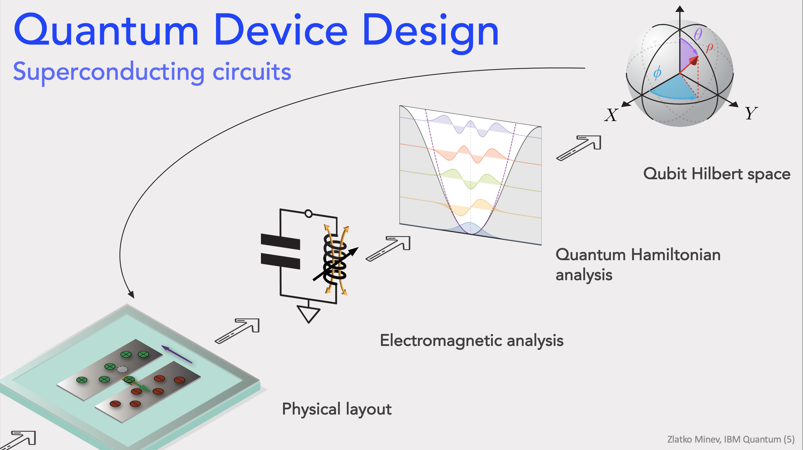
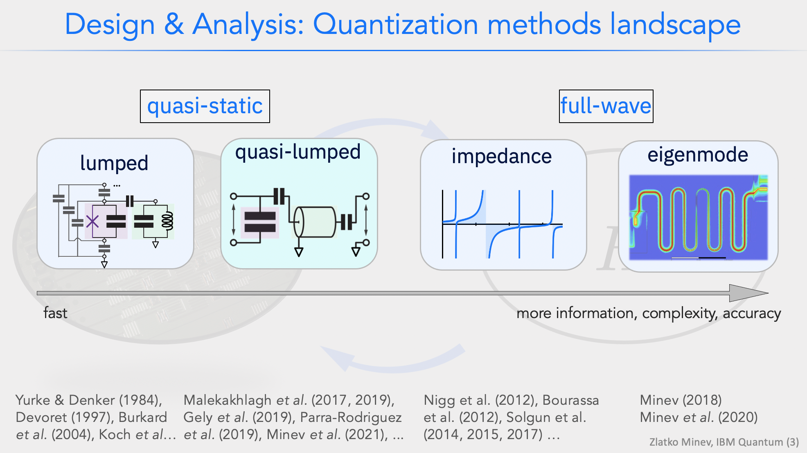
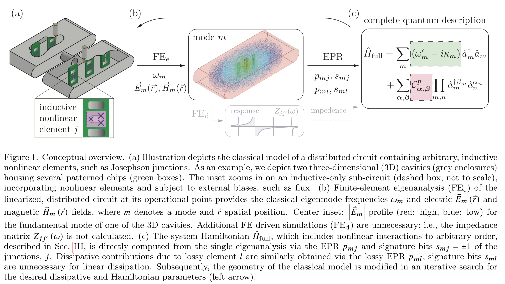

.. _workflow:

*********************
Roadmap
*********************

Near-term development roadmap:

.. image:: images/roadmap.png
   :alt: Missing Image

.. attention::

   We need input from you on what to prioritize and how to best shape so that Metal is useful to the wide community and hopefuly makes life easier for you too.
   Let us know through github issues, slack channel messages, or by telling us in one of the tutorials. 
   

In the near future we aim to (see near-term roadmap image):
**Legend:**
   ✓ Completed
   ✰ Desired
   ✰✰✰ Highly desired 

* **More quantum components**
   * ✓ Tunable couplers (community-driven)
   * ✓ Flux & control lines & terminations 
   * ✓ Routing manual-driven at 45 degrees, etc. 
   * ✓ Wirebonds in rendering
   * ✓ Star qubit
   * ✓ Fluxonium (community-driven)
   * Add JJ layout component
      * ✓ Dolan single JJ 
      * ✓ SQUID 
      * Array 
   * ✰✰ Cross-overs 
   * Novel qubits (community-driven) 
   * . . .
   
* **Add & enhance quantization analysis & ease of use**
   * ✓ New lumped analysis code
      * More general couplers
      * ✰✰✰ WebApp
   * Sweeping parameters, optimetrics 
      * ✓ for lumped analysis
      * ✓ for EPR analysis 
      * for Z, S, Y analysis 
   * ✰✰ Impedance quantization
      * Add fitting of Z curves & extraction of ZPF
   * ✰✰✰ pyEPR General potential - e.g. fluxonium
   * Improve ease of use & integration of pyEPR analysis 
      * and dissipative EPR analysis 
   * Better analysis interfaces and abstractions 
   * . . .
   
* **Hamiltonian analysis**
   * ✓ Pulse & gate analysis & time dynamics simulations 101
      * Advanced 
   * ✓ Integration with quantum analysis packages: qiskit pulse, qutip (interested in listing your package here? Let us know :) ) 101
   * ✓ Integration with scQubits 101
  
* **Code & ease of use**
   * Refactor and improve abstractions, interfaces, and data handling
      * Improved modularity of analysis 
   * Develop ease of use and one-click solutions
   * More features in the GUI
      * ✓ Create components from the GUI library  
      * ✓ Visual library with images
      * ✓ GUI to script 
      * Including customization of coloring layers, plotting options, more interactive component editing
   * WebApp

* **Features you request!** 
   So, let us know in the Slack channel (#metal):)

* **Longer term:**
   * Import from GDS ✰
   * Features you request! So, let us know in the Slack channel (#metal) :)

*********************
Qiskit Metal Workflow
*********************

.. attention::

   This section is under construction. 

Qiskit Metal enables chip prototyping in a matter of minutes. 
You can start from a convenient Python Jupyter notebook or take advantage of the user-friendly graphical user interface (GUI). Simply choose from a library of predefined quantum components, such as transmon qubits and coplanar resonators, and customize their parameters in real-time to fit your needs. Use the built-in algorithms to automatically connect components. Easily implement new experimental components using Python templates and examples.

.. image:: images/workflow.jpg
   :alt: Missing Workflow Diagram
   :width: 388
   :height: 683

|

Designing quantum devices is the bedrock of the quantum ecosystem,
but it is a difficult, multi-step process that connects traditionally disparate worlds.
Metal is automating and streamlining this process.

.. image:: images/colorful_workflow.jpg
   :alt: Missing Workflow Diagram

|

On the surface, designing a quantum chip should be a lot like designing any other integrated circuit. But a typical integrated circuit goes through a design flow process that’s had decades worth of tuning. As chips have scaled up in transistor count in step with Moore’s law, design tools have matured in kind, becoming automated. Today, a sequence of programs allow chip designers to think in a modular way about integrated circuits with billions of transistors, in a process that rather seamlessly creates and tests designs, then moves them to the fabrication stage.
Quantum computers are not like today’s computer microprocessors, though. Quantum bits are much larger than transistors, and require more complex superconducting circuitry. Computer-aided electronic design automation software covers only some parts of this intricate fabrication process, and using these software packages to design a quantum computer comes with a high barrier to entry.
In terms of a high-level description, we aim to perform the following tight feedback loop of design.
(read the full `Medium blog <https://medium.com/qiskit/what-if-we-had-a-computer-aided-design-program-for-quantum-computers-4cb88bd1ddea>`_)

|

|

*****************************
Quantization Methods Overview 
*****************************

.. attention::

   This section is under construction. 

We are currently implementing lumped, quasi-lumped, and full-wave quantization methods in Qiskit Metal.
The following image summarizes the main landscape of analysis and design methods:

|

-----------------------
Lumped-oscillator model
-----------------------

In the lumped-oscillator model, 
one extract the quasi-static capacitance 
and inductances of the effective network model from fast simulations. 

*Overview.* Extracting the Hamiltonian of interacting quantum-information processing systems 
is a keystone problem in the realization of complex phenomena and large-scale quantum computers.
The remarkable growth of the field increasingly requires precise, widely-applicable, and modular methods 
that can model the quantum electrodynamics of the physical circuits, and even of their more-subtle 
renormalization effects.

The lumped method can be a computationally-efficient method satisfying these criteria. 
The method partitions a quantum device into compact lumped or quasi-distributed cells. 
Each is first simulated individually. The composite system is then reduced and mapped to a set of simple
subsystem building blocks and their pairwise interactions. 
The method operates within the quasi-lumped approximation and systematically accounts for 
constraints, couplings, parameter renormalizations, and non-perturbative loading effects.

References: 

* Zlatko K. Minev, Thomas G. McConkey, Maika Takita, Antonio Corcoles, Jay M. Gambetta, 
  Circuit quantum electrodynamics (cQED) with modular quasi-lumped models. (2021)

.. image:: images/lump.png
   :alt: Missing Image
   :width: 388

.. image:: images/lumped2.png
   :alt: Missing Image
   :width: 400

|

---------------------------------------------------
Energy: The energy-participation-ratio (EPR) method
---------------------------------------------------

The energy-participation-ratio (EPR) method is a general (black-box) quantization method.
Based on the Qiskit Metal integration with `pyEPR <https://github.com/zlatko-minev/pyEPR>`_,
one can automate the design and quantization of Josephson quantum circuits,
and even 3D circuits. 

The EPR method is based on the energy-participation ratio (EPR) of a dissipative or nonlinear 
element in an electromagnetic mode. The EPR, a number between zero and one, quantifies how much 
of the energy of a mode is stored in each element. It obeys universal constraints—valid  
regardless of the circuit topology and nature of the nonlinear elements.
The EPR of the elements are calculated from a unique, efficient electromagnetic eigenmode 
simulation of the linearized circuit, including lossy elements. 
Their set is the key input to the determination of the quantum Hamiltonian of the system. 
The method provides an intuitive and simple-to-use tool to quantize multi-junction circuits. 
It is especially well-suited for finding the Hamiltonian and dissipative parameters of weakly 
anharmonic systems, such as transmon qubits coupled to resonators, or Josephson transmission lines.
The EPR method is experimentally tested on a variety of Josephson circuits, and demonstrated 
high agreement for nonlinear couplings and modal Hamiltonian parameters, over many order of
magnitude in energy.

References:

* Minev, Z. K., Leghtas, Z., Mudhada, S. O., Reinhold, P., Diringer, A., & Devoret, M. H. (2018). `pyEPR: The energy-participation-ratio (EPR) open-source framework for quantum device design. <https://github.com/zlatko-minev/pyEPR/blob/master/pyEPR.bib>`_
* Minev, Z. K., Leghtas, Z., Mundhada, S. O., Christakis, L., Pop, I. M., & Devoret, M. H. (2020). Energy-participation quantization of Josephson circuits. ArXiv. Retrieved from `http://arxiv.org/abs/2010.00620 <http://arxiv.org/abs/2010.00620>`_ (2020)
* Z.K. Minev, Ph.D. Dissertation, Yale University (2018), Chapter 4. `arXiv:1902.10355 <https://arxiv.org/abs/1902.10355>`_  (2018) 
* `pyEPR docs <https://pyepr-docs.readthedocs.io>`_

|

-------------------------------------------------------
Impedance: impedance-based black-box quantization (BBQ)
-------------------------------------------------------

"A semiclassical method for determining the effective low-energy quantum Hamiltonian of weakly anharmonic superconducting circuits
containing mesoscopic Josephson junctions coupled to electromagnetic environments made of an arbitrary combination of distributed and lumped elements.
A convenient basis, capturing the multimode physics, is given by the quantized eigenmodes of the linearized circuit and is fully determined 
by a classical linear response function."
Nigg *et al.* (2012).

References:

* Nigg, S. E., Paik, H., Vlastakis, B., Kirchmair, G., Shankar, S., Frunzio, L., … Girvin, S. M. (2012). Black-Box Superconducting Circuit Quantization. Physical Review Letters, 108(24), 240502. https://doi.org/10.1103/PhysRevLett.108.240502
* Bourassa, J., Beaudoin, F., Gambetta, J. M., & Blais, A. (2012). Josephson-junction-embedded transmission-line resonators: From Kerr medium to in-line transmon. Physical Review A, 86(1), 013814. https://doi.org/10.1103/PhysRevA.86.013814
* Solgun, F., Abraham, D. W., & DiVincenzo, D. P. (2014). Blackbox quantization of superconducting circuits using exact impedance synthesis. Physical Review B, 90(13), 134504. https://doi.org/10.1103/PhysRevB.90.134504

.. image:: images/z.png
   :alt: Missing Image
