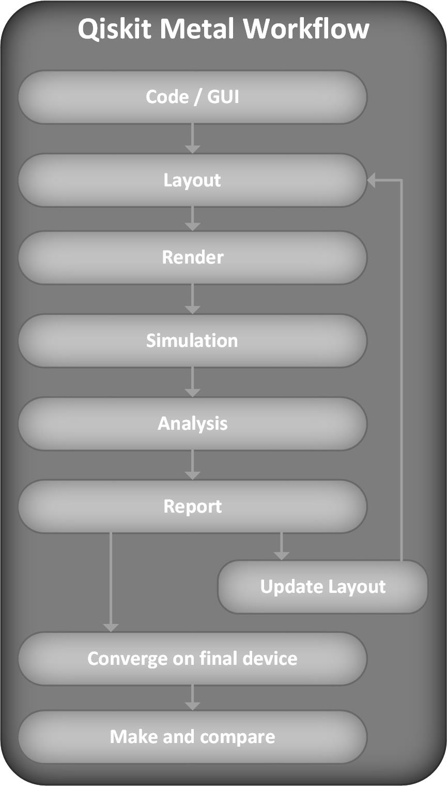
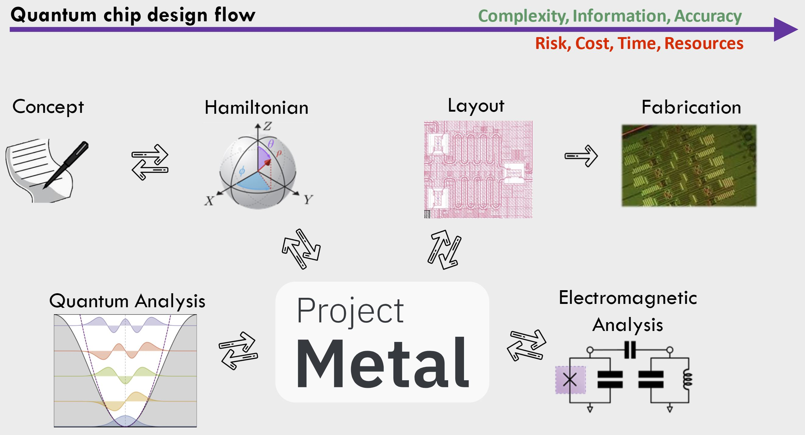
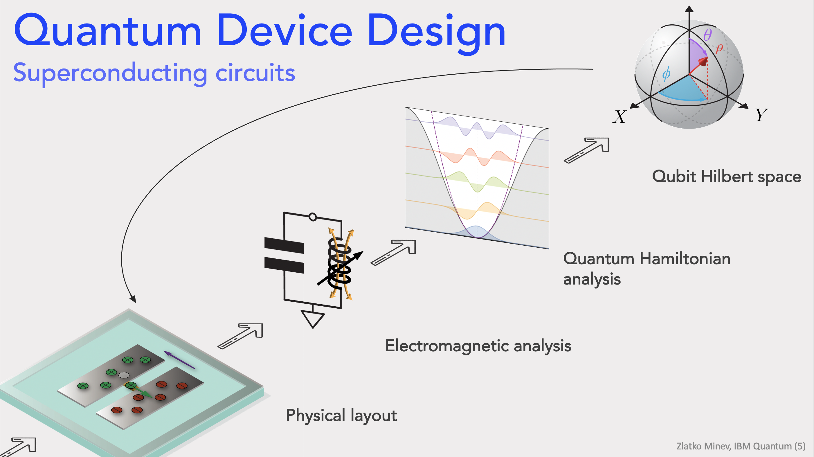

.. _workflow:

**********************
Quantum Metal Workflow
**********************

Quantum Metal enables chip prototyping in a matter of minutes.
You can start from a convenient Python Jupyter notebook or take advantage of the user-friendly graphical user interface (GUI). Simply choose from a library of predefined quantum components, such as transmon qubits and coplanar resonators, and customize their parameters in real-time to fit your needs. Use the built-in algorithms to automatically connect components. Easily implement new experimental components using Python templates and examples.

|

Designing quantum devices is the bedrock of the quantum ecosystem,
but it is a difficult, multi-step process that connects traditionally disparate worlds.
Metal is automating and streamlining this process.

|

On the surface, designing a quantum chip should be a lot like designing any other integrated circuit. But a typical integrated circuit goes through a design flow process that’s had decades worth of tuning. As chips have scaled up in transistor count in step with Moore’s law, design tools have matured in kind, becoming automated. Today, a sequence of programs allow chip designers to think in a modular way about integrated circuits with billions of transistors, in a process that rather seamlessly creates and tests designs, then moves them to the fabrication stage.
Quantum computers are not like today’s computer microprocessors, though. Quantum bits are much larger than transistors, and require more complex superconducting circuitry. Computer-aided electronic design automation software covers only some parts of this intricate fabrication process, and using these software packages to design a quantum computer comes with a high barrier to entry.
In terms of a high-level description, we aim to perform the following tight feedback loop of design.
(read the full `Medium blog <https://medium.com/qiskit/what-if-we-had-a-computer-aided-design-program-for-quantum-computers-4cb88bd1ddea>`_)

|

