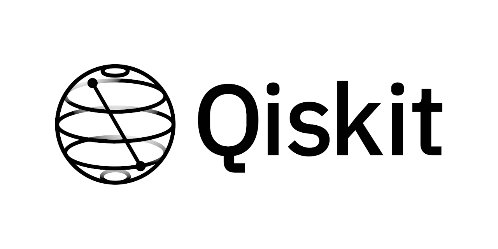
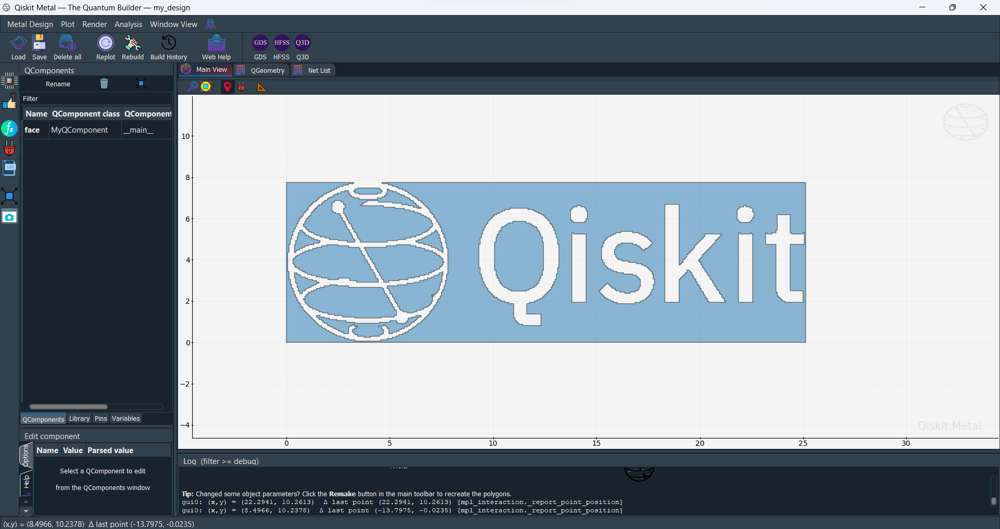
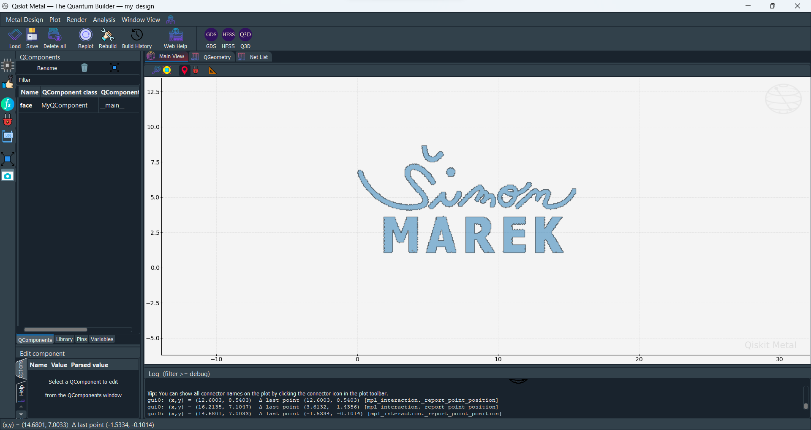
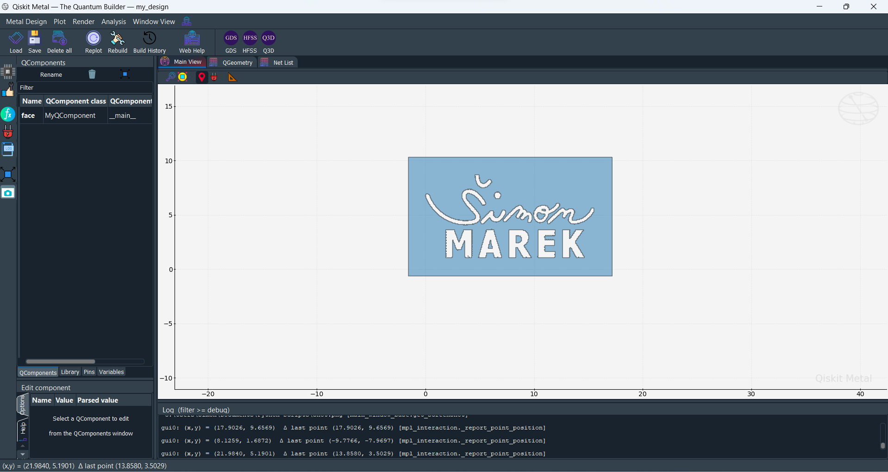

# Qiskit Metal - Add Logo

Import component to Qiskit Metal using Image

## Features

- Scaling
- Moving along axies
- Automatic image converting to correct formats

## Demonstration

#### Image to be imported to Qiskit

#### Qiskit Metal Logo

#### Qiskit Metal Logo 2

#### Qiskit Metal Logo 2 - different etch profile

## Appendix

Any additional information goes here

## Documentation

[QMetal](https://qiskit.org/documentation/metal/)
[Pillow](https://pillow.readthedocs.io/en/stable/)

