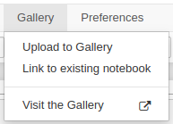
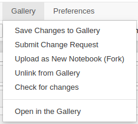
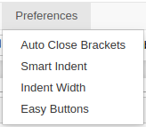

This extension adds the Gallery and Preferences menu to the Notebook UI.

The Gallery menu enables you to save notebooks to nbgallery.  The menu options will change depending on whether the current notebook is "linked" to one saved in nbgallery.

 

The Preferences menu enables you to save commonly-used editor options to nbgallery.  This can be useful if your Jupyter environment is not persistent; the NBGallery Environment Registration extension will download and re-apply those settings when Jupyter is started.

